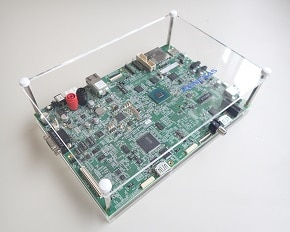
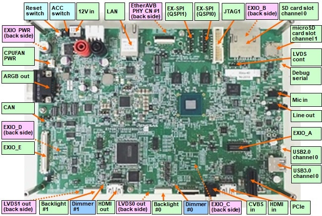

.. _rcar_ebisu:

Renesas R-Car Ebisu
###################

Overview
********

The Ebisu is an R-CarE3-specific evaluation board that can be used to evaluate systems using the R-CarE3 and to develop operating
systems, device drivers, and applications. Using the Ebisu board allows developers to efficiently conduct required tasks such as
evaluating the performance of an R-CarE3-based system and thus greatly reduce the turn-around time in their product development.

Hardware
********

Here are R-Car Ebisu hardware capabilities :

+-------------+------------------------------------------------------------------------------------+
| CPU         | R-CAR E3                                                                           |
|             |                                                                                    |
|             | - ARM CA53 (ARMv8) 1.2 GHz dual core, with NEON/VFPv4, L1$ I/D 32K/32K, L2$ 256K   |
|             | - ARM CR7 Dual Lockstep, $L1 32K/32K                                               |
|             | - Memory controller for DDR3L-SDRAM in 1 channel 32-bits wide                      |
|             | - Two- and three-dimensional graphics engines                                      |
|             | - Video processing units                                                           |
|             | - 2 channels Display Output                                                        |
|             | - 2 channels Video Input                                                           |
|             | - SD card host interface                                                           |
|             | - USB3.0 and USB2.0 interfaces                                                     |
|             | - 2 CAN interfaces                                                                 |
|             | - Ethernet AVB                                                                     |
|             | - PCI Express Interfaces                                                           |
+-------------+------------------------------------------------------------------------------------+
| Memories    | - 4G-BYTE (H3) or 2G-BYTE (M3) LPDDR4                                              |
|             | - 64M-BYTE HYPERFLASH                                                              |
|             | - 16M-BYTE QSPI FLASH                                                              |
|             | - 32G-BYTE EMMC                                                                    |
|             | - MICRO SD-CARD SLOT                                                               |
+-------------+------------------------------------------------------------------------------------+
| Connectors  | - CN1 JTAG Connector                                                               |
|             | - CN2 Flash memory sub-board connector                                             |
|             | - CN3 SPI Flash Memory connector                                                   |
|             | - CN4 SPI Flash Memory connector                                                   |
|             | - CN5 PCI Express Slot                                                             |
|             | - CN6 EXIO connector A                                                             |
|             | - CN9 USB 2.0 Micro-AB receptacle                                                  |
|             | - CN10 CAN-FD connector                                                            |
|             | - CN11 USB 3.0 standard-A receptacle                                               |
|             | - CN13 SD Card slot                                                                |
|             | - CN14 microSD Card slot                                                           |
|             | - CN15 DPAD RGB Output                                                             |
|             | - CN18 LVDS0 output                                                                |
|             | - CN19 LVDS0 Backlight power supply                                                |
|             | - CN20 HDMI input                                                                  |
|             | - CN21 RCA input                                                                   |
|             | - CN22 RJ-45 connector                                                             |
|             | - CN23 EthernetAVB PHY connector                                                   |
|             | - CN25 DEBUG SERIAL USB 2.0 Micro-AB receptacle                                    |
|             | - CN27 EXIO connector B                                                            |
|             | - CN28 EXIO connector D                                                            |
|             | - CN29 EXIO connector C                                                            |
|             | - CN30 Secondary Power Supply DC12.0V (for optional power supply unit)             |
|             | - CN32 Power supply connector for the EXIO board                                   |
|             | - CN34 Dedicated power supply connector for the CPU fan                            |
|             | - CN36 Power Supply DC12.0V (or AC-Adapter shipped with board)                     |
|             | - CN37 LVDS0 & LVDS1 hdmi output                                                   |
|             | - CN38 LVDS1 output                                                                |
|             | - CN39 LVDS1 Backlight power supply                                                |
|             | - CN41 LVDS cont connector                                                         |
|             | - CN42 Audio output                                                                |
|             | - CN43 Microphone input                                                            |
+-------------+------------------------------------------------------------------------------------+
| HW Spec     | - Dimensions: 230mm x 160mm                                                        |
|             | - External power supply 12V                                                        |
|             | - +25 degrees C at ambient temperature                                             |
+-------------+------------------------------------------------------------------------------------+

.. Note:: Zephyr will be flashed on the CR7 processor provided for RTOS purpose.

More information about the used chips can be found here :

- `Renesas R-Car E3 chip`_

Supported Features
==================

Here is current supported features when running Zephyr OS on the R-Car Ebisu CR7:

+-----------+------------------------------+--------------------------------+
| Interface | Driver/components            | Support level                  |
+===========+==============================+================================+
| PINMUX    | pinmux                       |                                |
+-----------+------------------------------+--------------------------------+
| CLOCK     | clock_control                |                                |
+-----------+------------------------------+--------------------------------+
| GPIO      | gpio                         |                                |
+-----------+------------------------------+--------------------------------+
| UART      | uart                         | serial port-polling            |
+-----------+------------------------------+--------------------------------+
| CAN       | can                          |                                |
+-----------+------------------------------+--------------------------------+
| IPM       | GIC 400 interrupt controller |                                |
+-----------+------------------------------+--------------------------------+
| TIMER     | TO DESCRIBE ?                |                                |
+-----------+------------------------------+--------------------------------+
| DISPLAY   | TO DESCRIBE ?                |                                |
+-----------+------------------------------+--------------------------------+
| OPENAMP   | TO DESCRIBE ?                |                                |
+-----------+------------------------------+--------------------------------+
| REMOTEPROC| TO DESCRIBE ?                |                                |
+-----------+------------------------------+--------------------------------+

Connections and IOs
===================

Ebisu :
-------

PINMUX :
--------

TODO !!!

CLOCK :
-------

TODO !!!

GPIO :
------

TODO !!!

UART :
------

Ebisu board is only providing one physical serial port, this one is physically interfaced on CN25 connector.

+--------------------+-------------------+--------------------+-----------+--------------------------------------+
| Physical Interface | Physical Location | Software Interface | Converter | Further Information                  |
+====================+===================+====================+===========+======================================+
| CN25 DEBUG SERIAL  | Ebisu             | SCIF2              | CP2102    | Used by U-BOOT & Linux               |
+--------------------+-------------------+--------------------+-----------+--------------------------------------+

.. Note:: Because bootloader and linux are commonly using this only available serial port, no serial port have been enabled by default in this board configuration. Everything is ready in order to use SCIF2 as serial port, Zephyr console or Zephyr shell. When used, SCIF2 serial port is initialized with settings 115200 8N1 without hardware flow control.

CN25 connector is equipped with a standard USB 2.0 Micro-AB connector.

CAN :
-----

Ebisu board is providing physical access to CAN interfaces through CN10 connector.

+--------------------+-------------------+--------------------+--------------+
| Physical Interface | Physical Location | Software Interface | Transceiver  |
+====================+===================+====================+==============+
| CN10 CAN Interface | Ebisu             | CAN0               | MCP2558FD    |
+--------------------+-------------------+--------------------+--------------+
|                    |                   | CAN1               |              |
+--------------------+-------------------+--------------------+--------------+

.. Note:: The Zephyr CAN driver for rcar_ebisu board is using CAN0 interfaces at 250kb/s and is allowing the use of both standard and extended ID CAN frames by default.

Here is CAN interfaces pinout on Kingfisher board :

+-----+--------+
| Pin | Signal |
+=====+========+
| 1   | CANH   |
+-----+--------+
| 2   | CANL   |
+-----+--------+
| 3   | 5.0V   |
+-----+--------+
| 4   | GND    |
+-----+--------+

.. Note:: Two 62Ω are equipping CAN0 interface by default.

IPM :
-----

TODO !!!

TIMER :
-------

TODO !!!

DISPLAY :
---------

TODO !!!

OPENAMP :
---------

TODO !!!

Programming and Debugging
*************************

The Cortex®-R7 of ebisu board needs to be started by the Cortex®-A cores. Cortex®-A cores are responsible to load the Cortex®-R7 binary application into the RAM, and get the Cortex®-R7 out of reset. The Cortex®-A can perform these steps at bootloader level or after the Linux system has booted through remoteproc.

Building
========

Applications for the ``rcar_ebisu_cr7`` board configuration can be built in the usual way (see :ref:`build_an_application` for more details).

.. zephyr-app-commands::
   :zephyr-app: samples/hello_world
   :board: rcar_ebisu_cr7
   :goals: build

Flashing
========
[How to use this board with Zephyr and how to flash a Zephyr binary on this
device]

//////flash app on board + r7 launch through remote proc

Debugging
=========
You can debug an application using OpenOCD and GDB. The Solution proposed below is using a OpenOCD custom version that support R-Car ULCB boards Cortex®-R7.

Get Renesas ready OpenOCD version
---------------------------------

.. code-block:: bash

	git clone --branch renesas https://github.com/iotbzh/openocd.git
	cd openocd
	./bootstrap
	./configure
	make
	sudo make install

Start Cortex®-R7
----------------

/////////////remote proc procedure

Start OpenOCD
-------------

.. code-block:: bash

	cd openocd
	sudo openocd -f tcl/interface/ftdi/olimex-arm-usb-ocd-h.cfg -f tcl/board/renesas_m3ulcb.cfg
	open an other console
	telnet 127.0.0.1 4444
	r8a77990.r7 arp_examine

Start Debugging
---------------

////////////west debug ?

References
**********

- `Renesas R-Car E3 chip`_
- `eLinux Ebisu`_

.. _Renesas R-Car E3 chip:
	https://www.renesas.com/br/en/products/automotive-products/automotive-system-chips-socs/r-car-e3-automotive-system-chip-soc-3d-graphics-clusters

.. _eLinux Ebisu :
	https://elinux.org/R-Car/Boards/Ebisu

