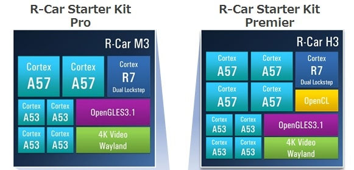
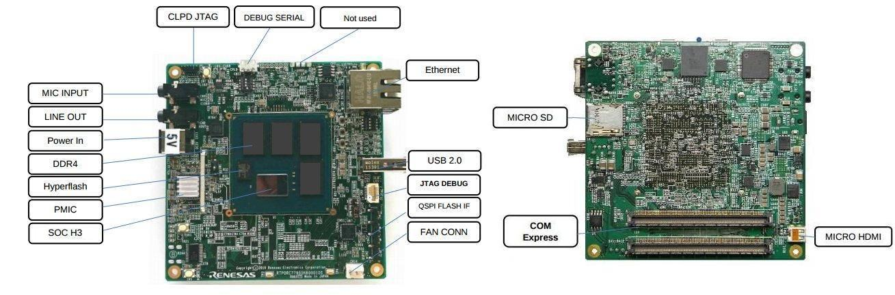
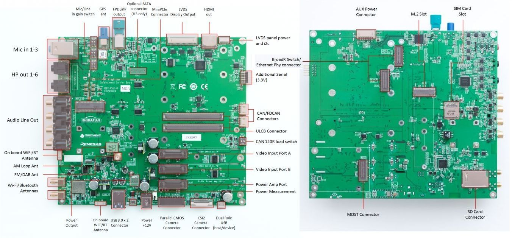

.. _rcar_ulcb_boards:

Renesas R-Car ULCB Starter Kit
##############################

Overview
********
- The H3 & M3 Starter Kit boards are designed for evaluating the features and performance of the R-CAR H3 & R-CAR M3 device from Renesas Electronics and it is also used for developing and evaluating application software for these R-CAR H3 & R-CAR M3.

  - The H3 Starter Kit, based on the R-CAR H3 SIP, comes with LPDDR4 @4GB in 2-channel, each 64-bit wide+Hyperflash @64MB, CSI2 interfaces and several communication interfaces like USB, Ethernet, HDMI and can work standalone or can be adapted to other boards, via 440pin connector on bottom side.

  - The M3 Starter Kit, based on the R-CAR M3 SIP, comes with LPDDR @2GB in 2-channels, each 32-bit wide. Other features are same as H3 Starter Kit.

It is possible to order 2 different types of H3 Starter Kit Boards, one with Ethernet connection onboard and one with Ethernet connection on ComExpress.
In case of M3 Starter Kit, it is possible to order with Ethernet Connection only.
This will be realized by a specific resistor configuration, and signed onboard with a label.

.. figure:: img/r-car-starter-kit.jpg
   :width: 460px
   :align: center
   :height: 288px
   :alt: R-Car starter kit

.. Note:: ULCB boards can be plugged on a Renesas Kingfisher Infotainment daughter board through COM Express connector in order to physically access more I/O. CAUTION : In this case, power supply is managed by the daughter board.

More information about the boards can be found at `Renesas R-Car Starter Kit website`_.

Hardware
********

Here are R-Car ULCBs starter kit hardware capabilities :

+------------+------------------------------------------------------------------------------------------------------+
| CPU        | R-CAR H3 or R-CAR M3                                                                                 |
|            | - ARM CA57 (ARMv8) 1.5 GHz quad (H3) or dual (M3) core, with NEON/VFPv4, L1$ I/D 48K/32K, L2$ 2MB    |
|            | - ARM CA53 (ARMv8) 1.2 GHz quad core, with NEON/VFPv4, L1$ I/D 32K/32K, L2$ 512K                     |
|            | - ARM CR7 Dual Lockstep, L1$ 32K/32K                                                                 |
|            | - Memory controller for LPDDR4 in 4 (H3) or 2 (M3) channels, each 64-bit (H3) or 32-bit (M3) wide    |
|            | - Two- and three-dimensional graphics engines                                                        |
|            | - Video processing units                                                                             |
|            | - 4 channels Display Output                                                                          |
|            | - 6 channels Video Input                                                                             |
|            | - SD card host interface                                                                             |
|            | - USB3.0 and USB2.0 interfaces                                                                       |
|            | - 2 CAN interfaces                                                                                   |
|            | - Ethernet AVB                                                                                       |
|            | - PCI Express Interfaces                                                                             |
+------------+------------------------------------------------------------------------------------------------------+
| Memories   | - INTERNAL 384KBYTES SYSTEM RAM                                                                      |
|            | - 4G-BYTE (H3) or 2G-BYTE (M3) LPDDR4                                                                |
|            | - 64M-BYTE HYPERFLASH                                                                                |
|            | - 16M-BYTE QSPI FLASH                                                                                |
|            | - 8G-BYTE EMMC                                                                                       |
|            | - MICRO SD-CARD SLOT                                                                                 |
+------------+------------------------------------------------------------------------------------------------------+
| Connectors | - CN1 COM Express type connector 440pin                                                              |
|            | - CN2 QSPI Flash module                                                                              |
|            | - CN3 DEBUG JTAG                                                                                     |
|            | - CN4 Micro HDMI                                                                                     |
|            | - CN5 USB 2.0                                                                                        |
|            | - CN6 Push-Pull microSD Card Socket                                                                  |
|            | - CN7 Ethernet, Connector, RJ45                                                                      |
|            | - CN8 LINE Out                                                                                       |
|            | - CN9 MIC Input                                                                                      |
|            | - CN10 DEBUG SERIAL(Do Not Stuff)                                                                    |
|            | - CN11 CPLD Programming JTAG                                                                         |
|            | - CN12 DEBUG SERIAL                                                                                  |
|            | - CN13 Main Power Supply input (5VDC)                                                                |
|            | - CN14 CPU Fan                                                                                       |
+------------+------------------------------------------------------------------------------------------------------+
| Switches   | - SW1 Hyper Flash                                                                                    |
|            | - SW2 Software Readable DIPSWITCHES (4x)                                                             |
|            | - SW3 Software Readable Push button                                                                  |
|            | - SW4 Software Readable Push button                                                                  |
|            | - SW5 Software Readable Push button                                                                  |
|            | - SW6 Mode Settings                                                                                  |
|            | - SW7 Reset                                                                                          |
|            | - SW8 Power                                                                                          |
|            | - SW9 Reset                                                                                          |
+------------+------------------------------------------------------------------------------------------------------+
| HW Spec    | - Dimensions: 95mm × 95mm                                                                            |
|            | - Board thickness: 1.6mm                                                                             |
|            | - External power supply 5V / 8A max, Ripple & Noise (Vp-p)                                           |
|            | - Full load 200mV                                                                                    |
|            | - T opr Operating ambient temperature.                                                               |
|            | - Free Air room temperature 25deg ave.                                                               |
|            | - Vcc 5V system power supply voltage (range 5V +- 5%)                                                |
|            | - Board Maximum current consumption 8A.                                                              |
+------------+------------------------------------------------------------------------------------------------------+

.. Note:: Zephyr will be flashed on the CR7 processor provided for RTOS purpose.

More information about SoCs can be found here :

- `Renesas R-Car H3 chip`_
- `Renesas R-Car M3 chip`_

Supported Features
==================

Here is current supported features when running Zephyr OS on the R-Car ULCB CR7:

+-----------+------------------------------+--------------------------------+
| Interface | Driver/components            | Support level                  |
+===========+==============================+================================+
| PINMUX    | pinmux                       |                                |
+-----------+------------------------------+--------------------------------+
| CLOCK     | clock_control                |                                |
+-----------+------------------------------+--------------------------------+
| GPIO      | gpio                         |                                |
+-----------+------------------------------+--------------------------------+
| UART      | uart                         | serial port-polling            |
+-----------+------------------------------+--------------------------------+
| CAN       | can                          |                                |
+-----------+------------------------------+--------------------------------+
| IPM       | GIC 400 interrupt controller |                                |
+-----------+------------------------------+--------------------------------+
| TIMER     | TO DESCRIBE ?                |                                |
+-----------+------------------------------+--------------------------------+
| DISPLAY   | TO DESCRIBE ?                |                                |
+-----------+------------------------------+--------------------------------+
| OPENAMP   | TO DESCRIBE ?                |                                |
+-----------+------------------------------+--------------------------------+
| REMOTEPROC| TO DESCRIBE ?                |                                |
+-----------+------------------------------+--------------------------------+

Connections and IOs
===================

ULCB Starter Kit :
------------------

Kingfisher Infotainment daughter board :
----------------------------------------

PINMUX :
--------

TODO !!!

CLOCK :
-------

TODO !!!

GPIO :
------

TODO !!!

UART :
------

ULCB Starter kit boards are providing two serial ports, only one is commonly available on the board, however, the second one can be made available either by welding components or by plugging the board on a Kingfisher Infotainment daughter board.

Here is information about these serial ports :

+--------------------+-------------------+--------------------+-----------+--------------------------------------+
| Physical Interface | Physical Location | Software Interface | Converter | Further Information                  |
+====================+===================+====================+===========+======================================+
| CN12 DEBUG SERIAL  | ULCB Board        | SCIF2              | FT232RQ   | Used by U-BOOT & Linux               |
+--------------------+-------------------+--------------------+-----------+--------------------------------------+
| CN10 DEBUG SERIAL  | ULCB Board        | SCIF1              | CP2102    | Non-welded                           |
+--------------------+-------------------+--------------------+-----------+--------------------------------------+
| CN04 DEBUG SERIAL  | Kingfisher        | SCIF1              |           | Secondary UART // Through ComExpress |
+--------------------+-------------------+--------------------+-----------+--------------------------------------+

.. Note:: The Zephyr console output is assigned to SCIF1 (commonly used on Kingfisher daughter board) with settings 115200 8N1 without hardware flow control by default.

Here is UART interface pinout (depending on your Kingfisher board version) :

+--------+----------+----------+
| Signal | Pin KF03 | Pin KF04 |
+========+==========+==========+
| RXD    | 3        | 4        |
+--------+----------+----------+
| TXD    | 5        | 2        |
+--------+----------+----------+
| RTS    | 4        | 1        |
+--------+----------+----------+
| CTS    | 6        | 3        |
+--------+----------+----------+
| GND    | 9        | 6        |
+--------+----------+----------+

CAN :
-----

ULCB Starter kit boards are not providing any physical access to CAN interfaces.

CAN interfaces are however available when plugged on a Kingfisher Infotainment daughter board.

Here is information about these CAN interfaces :

+--------------------+-------------------+--------------------+--------------+
| Physical Interface | Physical Location | Software Interface | Transceiver  |
+====================+===================+====================+==============+
| CN17 CAN Interface | Kingfisher        | CAN0               | TCAN332GDCNT |
+--------------------+-------------------+--------------------+--------------+
| CN18 CAN Interface | Kingfisher        | CAN1               | TCAN332GDCNT |
+--------------------+-------------------+--------------------+--------------+

.. Note:: The Zephyr CAN driver for rcar_ulcb boards is using CAN0 interfaces at 250kb/s and is allowing the use of both standard and extended ID CAN frames by default.

Here is CAN interfaces pinout on Kingfisher board :

+-----+--------+
| Pin | Signal |
+=====+========+
| 1   | CANH   |
+-----+--------+
| 2   | CANL   |
+-----+--------+
| 3   | GND    |
+-----+--------+

.. Note:: SW2 switch is enabling termination resistors for both CAN interfaces (ON : Enable, OFF : Disable).

IPM :
-----

TODO !!!

TIMER :
-------

TODO !!!

DISPLAY :
---------

TODO !!!

OPENAMP :
---------

TODO !!!

Programming and Debugging
*************************

The Cortex®-R7 of rcar_ulcb boards needs to be started by the Cortex®-A cores. Cortex®-A cores are responsible to load the Cortex®-R7 binary application into the RAM, and get the Cortex®-R7 out of reset. The Cortex®-A can perform these steps at bootloader level or after the Linux system has booted through remoteproc.

Building
========

Applications for the ``rcar_ulcb_cr7`` board configuration can be built in the usual way (see :ref:`build_an_application` for more details).

.. zephyr-app-commands::
   :zephyr-app: samples/hello_world
   :board: rcar_ulcb_cr7
   :goals: build

Flashing
========
[How to use this board with Zephyr and how to flash a Zephyr binary on this
device]

//////flash app on board + r7 launch through remote proc

Debugging
=========
You can debug an application using OpenOCD and GDB. The Solution proposed below is using a OpenOCD custom version that support R-Car ULCB boards Cortex®-R7.

Get Renesas ready OpenOCD version
---------------------------------

.. code-block:: bash

	git clone --branch renesas https://github.com/iotbzh/openocd.git
	cd openocd
	./bootstrap
	./configure
	make
	sudo make install

Start Cortex®-R7
----------------

/////////////remote proc procedure

Start OpenOCD
-------------

For M3ULCB starter kit :

.. code-block:: bash

	cd openocd
	sudo openocd -f tcl/interface/ftdi/olimex-arm-usb-ocd-h.cfg -f tcl/board/renesas_m3ulcb.cfg
	open an other console
	telnet 127.0.0.1 4444
	r8a77960.r7 arp_examine

For H3ULCB starter kit :

.. code-block:: bash

	cd openocd
	sudo openocd -f tcl/interface/ftdi/olimex-arm-usb-ocd-h.cfg -f tcl/board/renesas_h3ulcb.cfg
	open an other console
	telnet 127.0.0.1 4444
	r8a77950.r7 arp_examine

Start Debugging
---------------

////////////west debug ?

References
**********

- `Renesas R-Car Starter Kit website`_
- `Renesas R-Car H3 chip`_
- `Renesas R-Car M3 chip`_
- `eLinux H3SK`_
- `eLinux M3SK`_
- `eLinux Kingfisher`_

.. _Renesas R-Car Starter Kit website:
   https://www.renesas.com/br/en/products/automotive-products/automotive-system-chips-socs/r-car-h3-m3-starter-kit

.. _Renesas R-Car H3 chip:
	https://www.renesas.com/eu/en/products/automotive-products/automotive-system-chips-socs/r-car-h3-high-end-automotive-system-chip-soc-vehicle-infotainment-and-driving-safety-support

.. _Renesas R-Car M3 chip:
	https://www.renesas.com/eu/en/products/automotive-products/automotive-system-chips-socs/r-car-m3-automotive-system-chip-soc-ideal-medium-class-automotive-computing-systems

.. _eLinux H3SK:
	https://elinux.org/R-Car/Boards/H3SK

.. _eLinux M3SK:
	https://elinux.org/R-Car/Boards/M3SK

.. _eLinux Kingfisher:
	https://elinux.org/R-Car/Boards/Kingfisher
